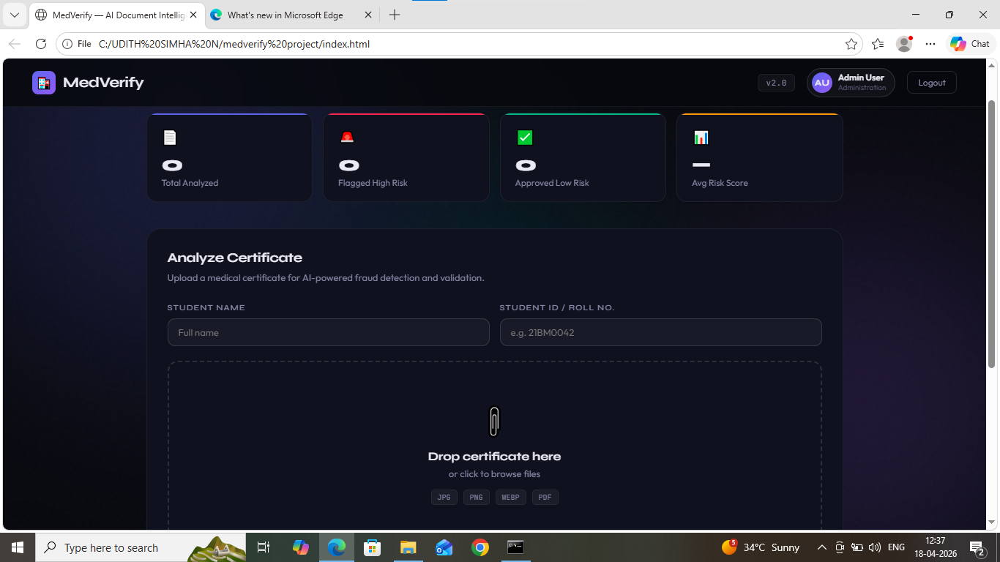
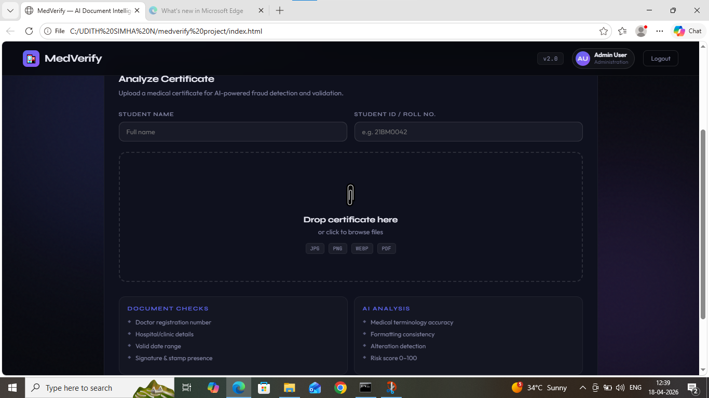

🏥 MedVerify — AI-Based Medical Certificate Verification System

🚀 Overview

MedVerify is an AI-powered system designed to detect fraudulent medical certificates using OCR and large language models. The system extracts text from uploaded certificates and evaluates authenticity using AI-based analysis.

🎯 Problem Statement

Fake medical certificates are commonly used in institutions, leading to misuse of leave policies and lack of trust in verification systems. Manual verification is time-consuming and error-prone.

💡 Solution

MedVerify automates certificate verification by:

- Extracting text using OCR (Tesseract)
- Analyzing content using Google Gemini AI
- Assigning a fraud risk score (0–100)
- Maintaining an audit log for tracking

🧠 Tech Stack

- Frontend: HTML, CSS, JavaScript
- Backend: FastAPI (Python)
- AI: Google Gemini API
- OCR: Tesseract

⚙️ Features

- Secure faculty login system
- Upload and verify medical certificates
- AI-based fraud detection
- Risk scoring system (0–100)
- Audit log tracking

🔄 Workflow

1. User uploads medical certificate
2. OCR extracts text from image/document
3. Extracted data is sent to Gemini AI
4. AI evaluates authenticity
5. System generates fraud risk score

📊 Output

- Fraud probability score
- Extracted text
- Verification result (Genuine / Suspicious)

🧪 How to Run

pip install -r requirements.txt
uvicorn server:app --reload

Open index.html in browser

🔐 Demo Login

Email: faculty@hospital.com
Password: medverify2025

📌 Future Improvements

- Integration with hospital databases
- Improved AI model accuracy
- Cloud deployment for scalability

🌍 Impact

This system can help educational institutions and organizations automate verification processes, reduce fraud, and improve operational efficiency.# 🏥 MedVerify — AI Medical Certificate Verification

## 🚀 Overview
MedVerify is an AI-based system that detects fake medical certificates using OCR and Google Gemini AI.

## 🧠 Tech Stack
- Frontend: HTML, CSS, JavaScript
- Backend: FastAPI (Python)
- AI: Google Gemini API
- OCR: Tesseract

## ⚙️ Features
- Faculty login system
- Upload medical certificates
- AI fraud detection
- Risk scoring (0–100)
- Audit log system

## 🧪 How to Run
1. Install dependencies:
   pip install -r requirements.txt

2. Run backend:
   uvicorn server:app --reload

3. Open index.html in browser

## 🔐 Demo Login
- faculty@hospital.com / medverify2025

## 📌 Future Improvements
- Add database
- Improve AI accuracy
- Deploy on cloud
  
##screenshots

